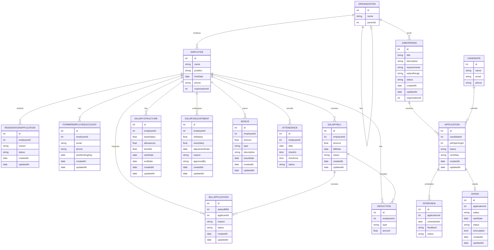

二、实体描述
1.1 实体及其属性
1.1.1 组织（Organization）
· 组织 ID (id): 唯一标识每个组织的编号。
· 名称 (name): 组织的名称。
· 父组织 ID (parentId): 父组织的编号，可为空。
· 子组织 (children): 子组织列表。
· 员工 (employees): 该组织下的员工列表。
· 职位开放 (jobOpenings): 该组织发布的职位列表。

1.1.2 员工（Employee）
· 员工 ID (id): 唯一标识每位员工的编号。
· 姓名 (name): 员工的姓名。
· 职位 (position): 员工的职位。
· 入职日期 (hireDate): 员工的入职日期。
· 联系电话 (phone): 员工的联系电话。
· 所属组织 ID (organizationId): 员工所属组织的编号。
· 离职申请 (ResignationApplication): 员工的离职申请列表。
· 离职人员账户 (FormerEmployeeAccount): 员工的离职人员账户列表。
· 薪资账单 (salaryBills): 员工的薪资账单列表。
· 账单申请 (billApplications): 员工的账单申请列表。
· 薪资结构 (salaryStructures): 员工的薪资结构列表。
· 薪资调整 (salaryAdjustments): 员工的薪资调整列表。
· 奖金 (bonuses): 员工的奖金列表。
· 考勤记录 (attendances): 员工的考勤记录列表。
· 扣除项 (deductions): 员工的扣除项列表。

1.1.3 职位开放（JobOpening）
· 职位 ID (id): 唯一标识每个职位的编号。
· 标题 (title): 职位的标题。
· 描述 (description): 职位的描述。
· 要求 (requirements): 职位的要求。
· 薪资范围 (salaryRange): 职位的薪资范围。
· 状态 (status): 职位的状态，例如：'开放', '已关闭'。
· 创建时间 (createdAt): 职位的创建时间。
· 更新时间 (updatedAt): 职位的更新时间。
· 发布组织 ID (organizationId): 发布该职位的组织编号。
· 申请 (applications): 该职位收到的申请列表。

1.1.4 候选人（Candidate）
· 候选人 ID (id): 唯一标识每位候选人的编号。
· 姓名 (name): 候选人的姓名。
· 邮箱 (email): 候选人的邮箱，唯一。
· 电话 (phone): 候选人的电话，可选。
· 申请 (applications): 候选人提交的申请列表。

1.1.5 申请（Application）
· 申请 ID (id): 唯一标识每个申请的编号。
· 候选人 ID (candidateId): 候选人的编号。
· 职位 ID (jobOpeningId): 申请职位的编号。
· 状态 (status): 申请状态，例如：'初筛通过', '待安排面试', 'offer 待发'。
· 下一步操作 (nextStep): 下一步操作，可选。
· 创建时间 (createdAt): 申请的创建时间。
· 更新时间 (updatedAt): 申请的更新时间。
· 面试 (interviews): 该申请相关的面试列表。
· Offer (offer): 该申请相关的 offer，可能为空。

1.1.6 面试（Interview）
· 面试 ID (id): 唯一标识每个面试的编号。
· 申请 ID (applicationId): 关联的申请编号。
· 安排时间 (scheduledAt): 面试安排时间。
· 反馈 (feedback): 面试反馈，可选。
· 状态 (status): 面试状态，例如：'待进行', '已完成', '已取消'。

1.1.7 Offer
· Offer ID (id): 唯一标识每个 offer 的编号。
· 申请 ID (applicationId): 关联的申请编号，唯一。
· 薪资 (salary): Offer 的薪资。
· 入职日期 (startDate): Offer 的入职日期。
· 状态 (status): Offer 的状态，例如：'待生成', '待审批', '已批', '已发送'。
· 是否接受 (isAccepted): 表示 Offer 是否被接受。
· 创建时间 (createdAt): Offer 的创建时间。
· 更新时间 (updatedAt): Offer 的更新时间。

1.1.8 离职申请（ResignationApplication）
· 离职申请 ID (id): 唯一标识每个离职申请的编号。
· 员工 ID (employeeId): 申请离职的员工编号。
· 离职原因 (reason): 离职原因。
· 状态 (status): 离职申请状态，例如：'待审批', '已批准', '已拒绝'。
· 创建时间 (createdAt): 离职申请的创建时间。
· 更新时间 (updatedAt): 离职申请的更新时间。

1.1.9 离职人员账户（FormerEmployeeAccount）
· 离职人员账户 ID (id): 唯一标识每个离职人员账户的编号。
· 员工 ID (employeeId): 离职员工编号。
· 邮箱 (email): 离职员工邮箱，唯一。
· 电话 (phone): 离职员工电话，可选。
· 最后工作日 (lastWorkingDay): 最后工作日。
· 创建时间 (createdAt): 离职人员账户的创建时间。
· 更新时间 (updatedAt): 离职人员账户的更新时间。

1.1.10 薪资账单（SalaryBill）
· 薪资账单 ID (id): 唯一标识每个薪资账单的编号。
· 员工 ID (employeeId): 关联的员工编号。
· 总额 (amount): 薪资总额。
· 账单日期 (billDate): 账单日期。
· 状态 (status): 账单状态，例如：'待支付', '已支付', '已取消'。
· 创建时间 (createdAt): 薪资账单的创建时间。
· 更新时间 (updatedAt): 薪资账单的更新时间。
· 账单申请 (billApplications): 与该账单相关的申请。
· 扣除项 (deductions): 该账单的扣除项。

1.1.11 账单申请（BillApplication）
· 账单申请 ID (id): 唯一标识每个账单申请的编号。
· 薪资账单 ID (salaryBillId): 关联的薪资账单编号。
· 申请人 ID (applicantId): 申请人（员工）编号。
· 申请原因 (reason): 申请原因。
· 状态 (status): 申请状态，例如：'待审核', '已批准', '已拒绝'。
· 创建时间 (createdAt): 账单申请的创建时间。
· 更新时间 (updatedAt): 账单申请的更新时间。

1.1.12 薪资结构（SalaryStructure）
· 薪资结构 ID (id): 唯一标识每个薪资结构的编号。
· 员工 ID (employeeId): 关联的员工编号。
· 基本工资 (baseSalary): 基本工资。
· 津贴 (allowances): 津贴。
· 福利 (benefits): 福利。
· 生效开始日期 (startDate): 生效开始日期。
· 生效结束日期 (endDate): 生效结束日期，可为空（表示当前有效）。
· 创建时间 (createdAt): 薪资结构的创建时间。
· 更新时间 (updatedAt): 薪资结构的更新时间。

1.1.13 薪资调整（SalaryAdjustment）
· 薪资调整 ID (id): 唯一标识每个薪资调整的编号。
· 员工 ID (employeeId): 关联的员工编号。
· 调整前的薪资 (oldSalary): 调整前的薪资。
· 调整后的薪资 (newSalary): 调整后的薪资。
· 调整日期 (adjustmentDate): 调整日期。
· 调整原因 (reason): 调整原因。
· 批准人 (approvedBy): 批准人。
· 创建时间 (createdAt): 薪资调整的创建时间。
· 更新时间 (updatedAt): 薪资调整的更新时间。

1.1.14 奖金（Bonus）
· 奖金 ID (id): 唯一标识每个奖金的编号。
· 员工 ID (employeeId): 关联的员工编号。
· 金额 (amount): 奖金金额。
· 类型 (type): 奖金类型，例如：'年终奖', '季度绩效', '项目奖金'。
· 描述 (description): 奖金描述。
· 发放日期 (issueDate): 发放日期。
· 创建时间 (createdAt): 奖金的创建时间。
· 更新时间 (updatedAt): 奖金的更新时间。

1.1.15 考勤记录（Attendance）
· 考勤记录 ID (id): 唯一标识每个考勤记录的编号。
· 员工 ID (employeeId): 关联的员工编号。
· 日期 (date): 考勤日期。
· 签到时间 (checkIn): 签到时间。
· 签退时间 (checkOut): 签退时间，可为空。
· 状态 (status): 考勤状态，例如：'正常', '迟到', '早退', '缺勤'。
· 备注 (note): 备注，可为空。
· 创建时间 (createdAt): 考勤记录的创建时间。
· 更新时间 (updatedAt): 考勤记录的更新时间。

1.1.16 扣除项（Deduction）
· 扣除项 ID (id): 唯一标识每个扣除项的编号。
· 员工 ID (employeeId): 关联的员工编号。
· 薪资账单 ID (salaryBillId): 关联的薪资账单编号。
· 类型 (type): 扣除类型，例如：'所得税', '社保', '公积金', '其他扣除'。
· 金额 (amount): 扣除金额。
· 描述 (description): 扣除描述，可为空。
· 创建时间 (createdAt): 扣除项的创建时间。
· 更新时间 (updatedAt): 扣除项的更新时间。

1.2 实体关系
1.2.1 组织与员工的关系（Organization - Employee）
· 关系类型：一对多（One-to-Many）
· 描述：每个组织可以有多个员工，每个员工只能属于一个组织。
· 参与类型：
· 组织：全程参与（每个组织必须有员工）
· 员工：全程参与（每个员工必须属于一个组织）

1.2.2 职位开放与申请的关系（JobOpening - Application）
· 关系类型：一对多（One-to-Many）
· 描述：每个职位开放可以有多个申请，每个申请只能对应一个职位开放。
· 参与类型：
· 职位开放：部分参与（一个职位开放可以没有申请）
· 申请：全程参与（每个申请必须关联一个职位开放）

1.2.3 候选人与申请的关系（Candidate - Application）
· 关系类型：一对多（One-to-Many）
· 描述：每个候选人可以有多个申请，每个申请只能对应一个候选人。
· 参与类型：
· 候选人：部分参与（一个候选人可以没有申请）
· 申请：全程参与（每个申请必须关联一个候选人）

1.2.4 申请与面试的关系（Application - Interview）
· 关系类型：一对多（One-to-Many）
· 描述：每个申请可以有多个面试，每个面试只能对应一个申请。
· 参与类型：
· 申请：部分参与（一个申请可以没有面试）
· 面试：全程参与（每个面试必须关联一个申请）

1.2.5 申请与 Offer 的关系（Application - Offer）
· 关系类型：一对一（One-to-One）
· 描述：每个申请只能有一个 Offer，每个 Offer 只能对应一个申请。
· 参与类型：
· 申请：部分参与（一个申请可以没有 Offer）
· Offer：全程参与（每个 Offer 必须关联一个申请）

1.2.6 员工与离职申请的关系（Employee - ResignationApplication）
· 关系类型：一对多（One-to-Many）
· 描述：每个员工可以有多个离职申请，每个离职申请只能对应一个员工。
· 参与类型：
· 员工：部分参与（一个员工可以没有离职申请）
· 离职申请：全程参与（每个离职申请必须关联一个员工）

1.2.7 员工与离职人员账户的关系（Employee - FormerEmployeeAccount）
· 关系类型：一对多（One-to-Many）
· 描述：每个员工可以有多个离职人员账户，每个离职人员账户只能对应一个员工。
· 参与类型：
· 员工：部分参与（一个员工可以没有离职人员账户）
· 离职人员账户：全程参与（每个离职人员账户必须关联一个员工）

1.2.8 员工与薪资账单的关系（Employee - SalaryBill）
· 关系类型：一对多（One-to-Many）
· 描述：每个员工可以有多个薪资账单，每个薪资账单只能对应一个员工。
· 参与类型：
· 员工：部分参与（一个员工可以没有薪资账单）
· 薪资账单：全程参与（每个薪资账单必须关联一个员工）

1.2.9 薪资账单与账单申请的关系（SalaryBill - BillApplication）
· 关系类型：一对多（One-to-Many）
· 描述：每个薪资账单可以有多个账单申请，每个账单申请只能对应一个薪资账单。
· 参与类型：
· 薪资账单：部分参与（一个薪资账单可以没有账单申请）
· 账单申请：全程参与（每个账单申请必须关联一个薪资账单）

1.2.10 员工与薪资结构的关系（Employee - SalaryStructure）
· 关系类型：一对多（One-to-Many）
· 描述：每个员工可以有多个薪资结构，每个薪资结构只能对应一个员工。
· 参与类型：
· 员工：部分参与（一个员工可以没有薪资结构）
· 薪资结构：全程参与（每个薪资结构必须关联一个员工）

1.2.11 员工与薪资调整的关系（Employee - SalaryAdjustment）
· 关系类型：一对多（One-to-Many）
· 描述：每个员工可以有多个薪资调整，每个薪资调整只能对应一个员工。
· 参与类型：
· 员工：部分参与（一个员工可以没有薪资调整）
· 薪资调整：全程参与（每个薪资调整必须关联一个员工）

1.2.12 员工与奖金的关系（Employee - Bonus）
· 关系类型：一对多（One-to-Many）
· 描述：每个员工可以有多个奖金，每个奖金只能对应一个员工。
· 参与类型：
· 员工：部分参与（一个员工可以没有奖金）
· 奖金：全程参与（每个奖金必须关联一个员工）

1.2.13 员工与考勤记录的关系（Employee - Attendance）
· 关系类型：一对多（One-to-Many）
· 描述：每个员工可以有多个考勤记录，每个考勤记录只能对应一个员工。
· 参与类型：
· 员工：部分参与（一个员工可以没有考勤记录）
· 考勤记录：全程参与（每个考勤记录必须关联一个员工）

1.2.14 员工与扣除项的关系（Employee - Deduction）
· 关系类型：一对多（One-to-Many）
· 描述：每个员工可以有多个扣除项，每个扣除项只能对应一个员工。
· 参与类型：
· 员工：部分参与（一个员工可以没有扣除项）
· 扣除项：全程参与（每个扣除项必须关联一个员工）

1.3 实体关系图（ERD）概述

